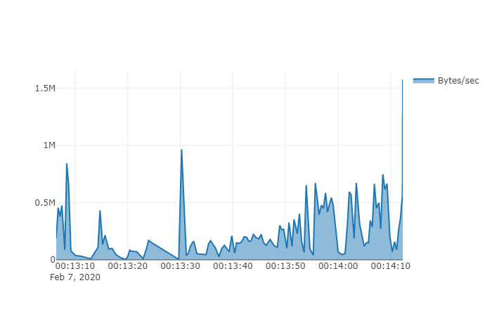

# fs-kaggle
Minimalist jupyter-friendly Kaggle dataset downloader written if F#. Includes CLI and allows progress report customization.


#### The following has been converted to markdown from [C# Examples.ipynb](https://github.com/SpaceAntelope/fs-kaggle/blob/master/Notebooks/CS%20Example.ipynb)
#### F# version coming soon

# Minimum code needed to get things going

If you're already setup with a kaggle account and the <code>kaggle.json</code> file is under *~/.kaggle*, you can just declare the name of the dataset and the dataset owner and sit back while the requested dataset zip is downloaded to the current directory.

[Sample dataset](https://www.kaggle.com/selfishgene/historical-hourly-weather-data)


```C#
using FsKaggle.Interop;
using Kaggle = FsKaggle.Interop.Kaggle;

var options = new DatasetInfo { Owner = "dataset-owner", Dataset = "dataset-name" };

// If you are just trying things out, consider using the Request parameter to target 
// a specific file from the dataset to reduce the waiting.
await Kaggle.DownloadDatasetAsync(options);    
```
### Output:

    historical-hourly-weather-data.zip [||||||||||||||||||||||||||||||||||||||||||||||||||||||||||||||| 100.00%] 11.97 of 11.97MB @ 868.86KB/s


# Setup a custom progress tracker

(default progress tracker at <code>FsKaggle.Reporter.ProgressBar</code>)

Waiting for kaggle data to travel over the net can be tedious, so consider the reporting callback property to visualise your progress or even make a rough estimation of the time remaining.

All you need is a function that takes an FsKaggle.ProgressData argument, which is an F# record that looks like this:

<code>type ProgressData = { TimeStamp: DateTime; Notes: string; BytesRead: int64; TotalBytes: int64; BytesPerSecond: float }</code>


```C#
using FsKaggle;
using System;

// A log of progress reports.
var report = new List<ProgressData>();

// A progress reporting function
void simpleProgressTracking(ProgressData data) {
    report.Add(data);
        
    var percent = (int)(Math.Ceiling(100.0*data.BytesRead/data.TotalBytes));
    
    var bar = "[".PadRight(percent,'|') + "]".PadLeft(100-percent, ' ');
    
    var status = $"{percent}% @ {Math.Round(data.BytesPerSecond/1024,2)}KB/s";
    
    // Since it considers only the latest speed, this metric is likely to fluctuate wildly.
    var remainingTime = TimeSpan.FromSeconds((data.TotalBytes - data.BytesRead)/data.BytesPerSecond);
    
    // We end the string with a carriage return (\r) so it updates the same line
    // instead of adding a line every iteration.
    Console.Write($"{bar} {status} {remainingTime.ToString("mm\\:ss")}\r");
}
```


```C#
await Kaggle.DownloadDatasetAsync(
    new DownloadDatasetOptions 
    {
        DatasetInfo = options, 
        ReportingCallback = simpleProgressTracking, 
        Overwrite = true 
    });
```
### Output:

    [|||||||||||||||||||||||||||||||||||||||||||||||||||||||||||||||||||||||||||||||||||||||||||||||||||] 100% @ 1537.59KB/s 00:00


The <code>DownloadDatasetOptions</code> type, other than the reporting callback, contains a few additional parameters:
* **KaggleJsonPath**: Where to look the API key info. By default it checks *~/.kaggle/kaggle.json*
* **DestinationFolder**: Send incoming files to some other existing directory.
* **Overwrite**: Default is false, otherwise any existing file with the same name will be overwritten without confirmation.
* **CancellationToken**: In case you think you might need to manually stop the download.


```C#
using System.IO;

if (!Directory.Exists("Data")) 
    Directory.CreateDirectory("Data");

var advancedOptions = new DownloadDatasetOptions {
    DatasetInfo = options,
    KaggleJsonPath = @"C:\Credentials\kaggle.json",
    DestinationFolder = "Data",
    ReportingCallback = FsKaggle.Reporter.ProgressBar,
    Overwrite = true
};
```

# Obligatory jupyter notebook data plot

Oh so that's why we logged the progress reports...


```C#
using XPlot.Plotly;
using System.Linq;

Chart.Plot(
    new Graph.Scatter
    { 
        name = "Bytes/sec", 
        showlegend=true,
        x = report.Select(r => r.TimeStamp), 
        y = report.Select(r => r.BytesPerSecond), 
        fill="tozeroy"
    })
```

### Output:



